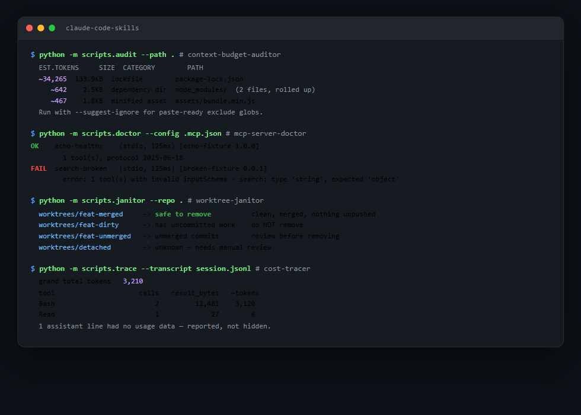

# claude-code-skills

**Five small, dependency-free tools for the problems that actually waste an
agent session — before they waste it.** Each is a [Claude Code](https://docs.claude.com/en/docs/claude-code)
skill (drop the folder in, ask in plain English) *and* a standalone CLI
(`python -m scripts.foo`, zero third-party dependencies, runs anywhere with
Python 3.11+).

Coding agents like Claude Code and Codex fail in a small number of
predictable, expensive ways: a huge lockfile silently eats the context
budget, an MCP server is misconfigured and the failure only surfaces mid-task,
abandoned worktrees from parallel agent runs pile up unnoticed, nobody can
say *why* a session got expensive after the fact, and nobody can say whether
the agent's own output was actually correct. None of that needs an LLM to
diagnose — it needs a script that tells the truth. That's what's here.



| Skill | Answers | Try it |
|---|---|---|
| [`context-budget-auditor`](context-budget-auditor/) | What in this repo will blow my context budget before I even start? | `python -m scripts.audit --path .` |
| [`mcp-server-doctor`](mcp-server-doctor/) | Is my MCP config actually working, or will it fail mid-task? | `python -m scripts.doctor --config .mcp.json` |
| [`worktree-janitor`](worktree-janitor/) | Which of these git worktrees are safe to clean up? | `python -m scripts.janitor --repo .` |
| [`cost-tracer`](cost-tracer/) | Where did this session's tokens actually go? | `python -m scripts.trace --transcript session.jsonl` |
| [`agent-eval-harness`](agent-eval-harness/) | Does my agent's own output actually hold up, and did this change regress it? | see skill README |

## The rule all five follow

**Never fabricate a result.** Every number here is either measured or
explicitly labelled an estimate; every check either verifiably passes or
reports the real reason it didn't. `context-budget-auditor` says "bytes ÷ 4,
not a tokenizer" out loud instead of pretending precision. `mcp-server-doctor`
never invokes a tool to "test" it — real MCP tools have real side effects, so
it stops at the JSON-RPC handshake and schema validation. `worktree-janitor`
never defaults an ambiguous case to "safe to delete." `cost-tracer` counts
transcript lines with missing usage data instead of silently zero-filling
them. Get this wrong and the tool is worse than no tool — it's the same
fabricated-confidence problem these skills exist to catch elsewhere.

## Install

Each skill is self-contained — copy the folder you want into your Claude Code
skills directory:

```bash
cp -r claude-code-skills/context-budget-auditor ~/.claude/skills/
```

Or use any of them standalone, no Claude Code involved, straight from a clone
of this repo — see each skill's own README for the exact commands and sample
output.

## Layout

```
claude-code-skills/
├── context-budget-auditor/   # scan a repo for context-expensive files before a session
├── mcp-server-doctor/        # real JSON-RPC handshake + schema check for MCP servers
├── worktree-janitor/         # audit + safely prune stale git worktrees
├── cost-tracer/              # attribute a session's token spend, from its own transcript
├── agent-eval-harness/       # evaluate whether an agent's own output is actually correct
└── LICENSE                   # MIT, applies to all five
```

## Related work

Same "never fabricate a result" discipline, as a standalone app with a
dashboard and hosted demo instead of a Claude Code skill:
[`agent-eval-harness`](https://github.com/siddharthgaur1/agent-eval-harness)
(the app, not this repo's skill folder of the same name).

## License

MIT — see [LICENSE](LICENSE). Each skill folder ships its own copy of the
same license for standalone use.
