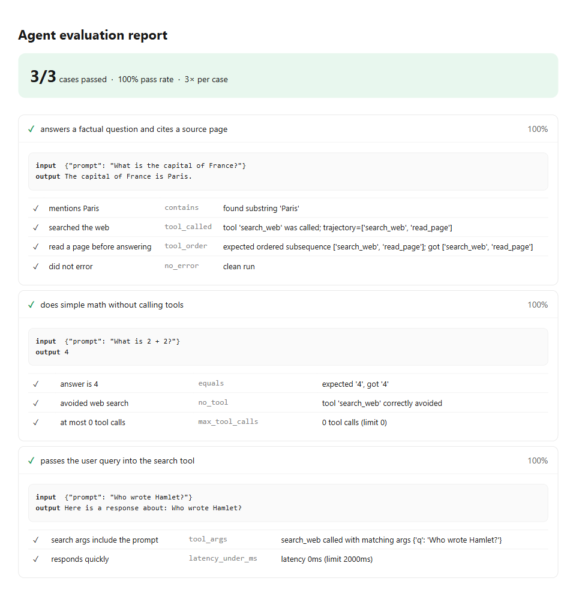

# agent-eval-harness

A [Claude Code](https://docs.claude.com/en/docs/claude-code) **skill** for
scaffolding and running evaluation suites for LLM agents — trajectory and
tool-call correctness, output assertions, LLM-as-judge grading, regression
testing against a golden set, and a self-contained HTML report.

Building an agent is easy; knowing whether it *works* is the hard part. This
skill turns "it seemed fine when I tried it" into a repeatable, quantitative
signal you can run on every change — with one rule throughout: **never fabricate
a result.** A check verifiably passes or it fails; subjective quality is graded
by an explicit judge, never a silent guess.

Want the same ideas as a standalone app with a dashboard, regression baselines,
and a hosted demo instead of a Claude Code skill? See
[agent-eval-harness](https://github.com/siddharthgaur1/agent-eval-harness).

## What's a skill?

A skill is a folder with a `SKILL.md` that teaches Claude Code a repeatable
workflow. Drop this folder into your Claude Code skills directory (or install
the packaged `.skill`), and asking Claude to "set up evals for my agent" will
invoke this workflow. The `scripts/` here are real, runnable code the skill
drives — not pseudocode.

## Use it standalone (no Claude Code required)

The harness runs on its own with zero third-party dependencies (Python 3.11+):

```bash
python -m scripts.run_evals \
  --eval-set examples/example_eval_set.json \
  --agent examples.echo_agent:run \
  --out results.json \
  --repeats 3

python -m scripts.report --results results.json --out report.html
```

```
PASS  3/3 cases  (100%)
  ✓ answers a factual question and cites a source page 100%
  ✓ does simple math without calling tools 100%
  ✓ passes the user query into the search tool 100%
```

`report.html` is a self-contained page — every assertion, its detail, and the
input/output that produced it, expandable per case:



Point `--agent` at your own `module:function`. The only contract is the return
shape:

```python
def run(input: dict) -> dict:
    return {
        "output": "final answer",
        "trajectory": [{"tool": "search_web", "args": {"q": "..."}}],  # optional
        "tokens": 512,                                                 # optional
    }
```

## What you can assert

Deterministic (free, reproducible): `contains`, `not_contains`, `equals`,
`regex`, `tool_called`, `no_tool`, `tool_order`, `tool_args`, `max_tool_calls`,
`latency_under_ms`, `no_error`. Subjective quality: `llm_judge` (pluggable;
raises rather than passing if no judge is configured).

See [`references/grader-design.md`](references/grader-design.md) for the full
catalogue and how to build a trustworthy judge, and
[`references/trajectory-eval.md`](references/trajectory-eval.md) for extracting
trajectories from LangGraph, OpenAI, and Anthropic agents.

## Layout

```
agent-eval-harness/
├── SKILL.md                     # the skill: workflow Claude Code follows
├── scripts/
│   ├── graders.py               # deterministic assertions + judge interface
│   ├── run_evals.py             # runner: invoke agent, grade, aggregate
│   └── report.py                # results.json -> self-contained HTML
├── references/
│   ├── grader-design.md         # assertion catalogue + LLM-judge design
│   └── trajectory-eval.md       # trajectory extraction per framework
├── assets/
│   ├── eval_set.schema.json     # eval-set JSON schema
│   └── screenshots/             # report.html example, for the README
└── examples/
    ├── echo_agent.py            # reference agent entrypoint
    └── example_eval_set.json    # runnable example eval set
```

## Design principles

- **Deterministic first** — check in code what you can; use the judge only where
  meaning genuinely can't be captured otherwise.
- **No fabricated results** — missing data fails honestly; a judge-less
  `llm_judge` assertion raises instead of silently passing.
- **Trajectory ≠ output** — for agents, *how* the answer was reached is graded
  alongside the answer.
- **Regressions are cases** — every bug becomes a permanent eval case.
- **The golden set is the product** — the leverage is dataset breadth, not the
  harness.

## License

MIT — see [LICENSE](LICENSE).
